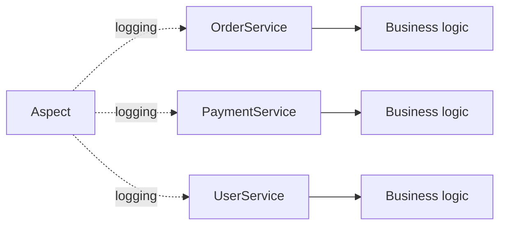
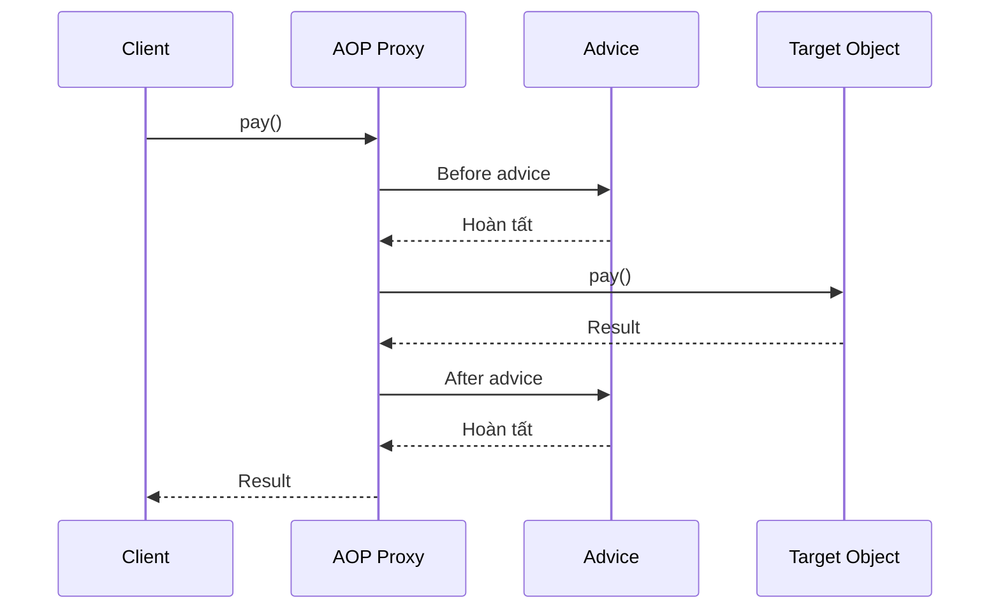
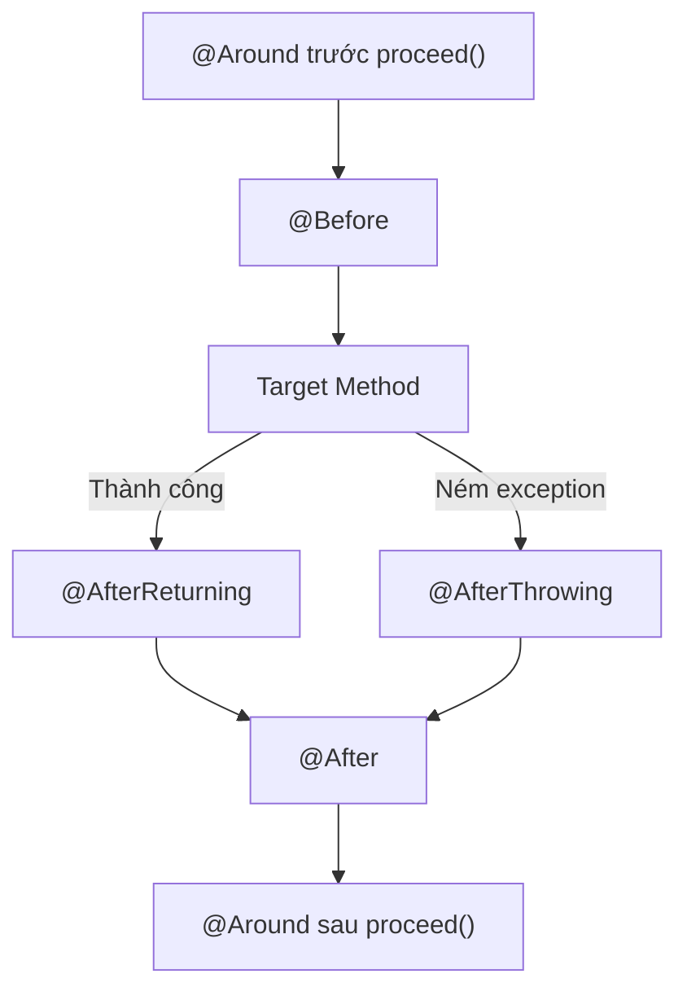
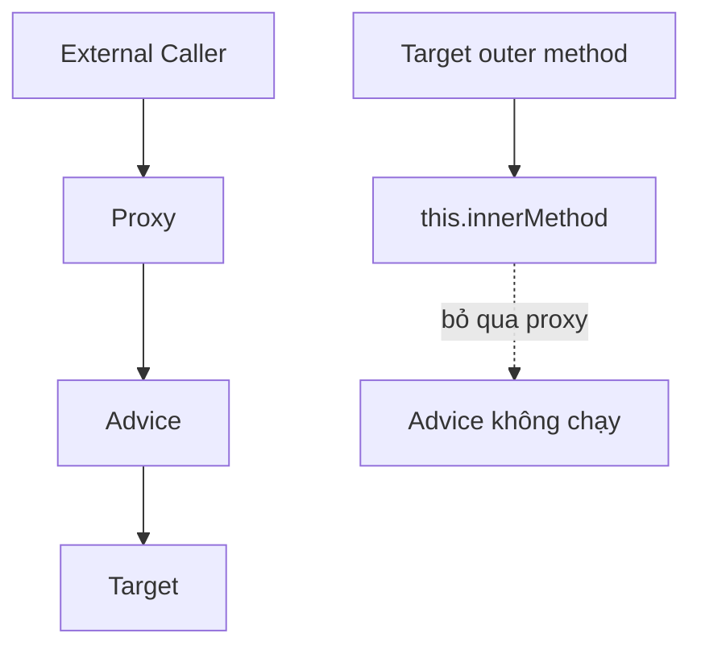
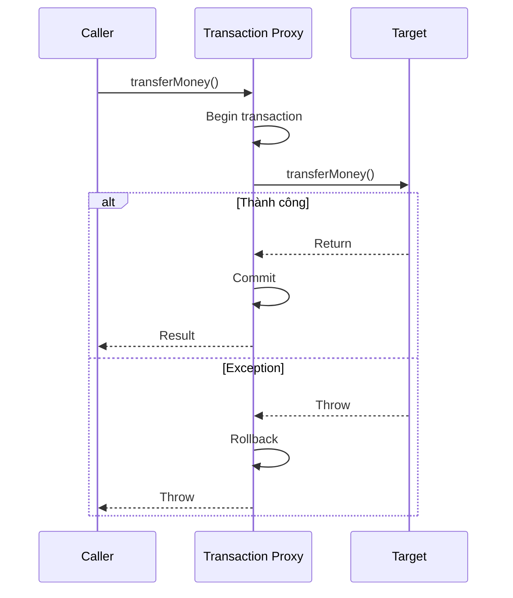

# ASPECT-ORIENTED PROGRAMMING (AOP) TRONG SPRING

> Tài liệu tổng hợp phần AOP: lý do sử dụng, các khái niệm cốt lõi, proxy, pointcut, advice, `@AspectJ`, self-invocation và ví dụ thực tế.

---

## Mục lục

1. [AOP là gì?](#1-aop-là-gì)
2. [Vì sao cần AOP?](#2-vì-sao-cần-aop)
3. [Cách Spring AOP hoạt động](#3-cách-spring-aop-hoạt-động)
4. [Các khái niệm cốt lõi](#4-các-khái-niệm-cốt-lõi)
5. [Cấu hình AOP](#5-cấu-hình-aop)
6. [Pointcut expression](#6-pointcut-expression)
7. [Các loại advice](#7-các-loại-advice)
8. [JoinPoint và ProceedingJoinPoint](#8-joinpoint-và-proceedingjoinpoint)
9. [JDK Dynamic Proxy và CGLIB](#9-jdk-dynamic-proxy-và-cglib)
10. [Spring AOP và AspectJ](#10-spring-aop-và-aspectj)
11. [Self-invocation](#11-self-invocation)
12. [Ví dụ hoàn chỉnh](#12-ví-dụ-hoàn-chỉnh)
13. [AOP trong Spring](#13-aop-trong-spring)
14. [Khi nào nên dùng AOP?](#14-khi-nào-nên-dùng-aop)
15. [Các lỗi thường gặp](#15-các-lỗi-thường-gặp)
16. [Bảng ghi nhớ nhanh](#16-bảng-ghi-nhớ-nhanh)

---

# 1. AOP là gì?

**AOP – Aspect-Oriented Programming** là lập trình hướng khía cạnh.

AOP không thay thế OOP. Nó bổ sung cho OOP bằng cách tách các logic xuất hiện lặp lại ở nhiều class hoặc method thành module riêng gọi là **aspect**.

Trong OOP, class là đơn vị tổ chức chính:

```text
OrderService
UserService
PaymentService
BookService
```

Nhưng trong ứng dụng thường có các logic xuất hiện ở nhiều nơi:

```text
Logging
Transaction
Security
Authorization
Audit
Caching
Retry
Performance measurement
Notification
Exception monitoring
```

Các logic này được gọi là **cross-cutting concerns**.



Câu hiểu đơn giản:

> AOP giúp tách logic dùng chung khỏi business logic, sau đó tự động áp dụng logic đó vào các method phù hợp.

---

# 2. Vì sao cần AOP?

Giả sử có class:

```java
public class A {

    public void m1() {
        // Business logic
    }

    public void m2() {
        // Business logic
    }

    public void m3() {
        // Business logic
    }

    public void n1() {
        // Business logic
    }
}
```

Yêu cầu:

> Sau khi gọi các method bắt đầu bằng `m`, cần ghi log và gửi notification.

Nếu không dùng AOP:

```java
public void m1() {
    // Business logic

    logger.info("m1 completed");
    notificationService.send("m1 completed");
}

public void m2() {
    // Business logic

    logger.info("m2 completed");
    notificationService.send("m2 completed");
}
```

Vấn đề:

- Code lặp lại.
- Business logic bị trộn với infrastructure logic.
- Dễ quên thêm logging vào method mới.
- Khi thay đổi chính sách log phải sửa nhiều nơi.

## 2.1 Code tangling

Nhiều trách nhiệm bị trộn trong một method:

```java
public void transferMoney(...) {
    logger.info("Start");

    checkPermission();

    try {
        beginTransaction();

        withdraw();
        deposit();

        commitTransaction();

        audit();
        notifyUser();
    } catch (Exception exception) {
        rollbackTransaction();
        throw exception;
    }
}
```

## 2.2 Code scattering

Cùng một logic bị rải rác ở nhiều class:

```text
OrderService    → logging
PaymentService  → logging
UserService     → logging
BookService     → logging
```

Với AOP:

```java
@Aspect
@Component
public class LoggingAspect {

    @AfterReturning(
        "execution(* com.example..m*(..))"
    )
    public void logSuccess() {
        logger.info("Method completed");
    }
}
```

Business method chỉ còn nghiệp vụ.

---

# 3. Cách Spring AOP hoạt động

Spring AOP chủ yếu hoạt động bằng **proxy**.

```java
@Service
public class PaymentService {

    public void pay() {
        System.out.println("Processing payment");
    }
}
```

Khi `pay()` được aspect áp dụng, caller thường gọi proxy thay vì target trực tiếp.



Luồng:

```text
Caller
   ↓
AOP Proxy
   ↓
Advice trước
   ↓
Target method
   ↓
Advice sau
   ↓
Return value
```

Proxy:

1. Nhận lời gọi method.
2. Kiểm tra pointcut.
3. Chạy advice phù hợp.
4. Gọi target method.
5. Xử lý kết quả hoặc exception.
6. Trả kết quả cho caller.

---

# 4. Các khái niệm cốt lõi

```text
Aspect
Join point
Pointcut
Advice
Target object
Proxy
Weaving
```

Công thức dễ nhớ:

```text
Aspect
= Pointcut + Advice
= Chạy ở đâu + Chạy logic gì
```

## 4.1 Aspect

Aspect là class chứa cross-cutting concern.

```java
@Aspect
@Component
public class LoggingAspect {
}
```

- `@Aspect`: class chứa khai báo AOP.
- `@Component`: đăng ký class thành Spring bean.

`@Aspect` một mình không đảm bảo class được component scanning đăng ký.

Có thể đăng ký bằng `@Bean`:

```java
@Configuration
public class AopConfig {

    @Bean
    public LoggingAspect loggingAspect() {
        return new LoggingAspect();
    }
}
```

## 4.2 Join point

Join point là điểm AOP có khả năng can thiệp.

Trong Spring AOP, join point chủ yếu là:

> Method execution trên Spring-managed bean.

Ví dụ:

```java
@Service
public class OrderService {

    public void createOrder() {
    }

    public void cancelOrder() {
    }
}
```

Các join point:

```text
createOrder() được thực thi
cancelOrder() được thực thi
```

## 4.3 Pointcut

Pointcut là điều kiện chọn join point.

```text
Join point = tất cả điểm có thể can thiệp.
Pointcut   = chọn điểm thực sự muốn can thiệp.
```

Ví dụ:

```java
execution(* m*(..))
```

chọn:

```text
m1()
m2()
m3()
```

không chọn:

```text
n1()
n2()
```

Named pointcut:

```java
@Pointcut(
    "execution(* com.example.service..*(..))"
)
public void serviceLayer() {
}
```

Method `serviceLayer()` chỉ đóng vai trò tên, không chứa business logic.

## 4.4 Advice

Advice là code chạy tại join point được pointcut chọn.

```java
@Before(
    "execution(* com.example.service..*(..))"
)
public void logBefore() {
    System.out.println("Method is about to run");
}
```

Cách nhớ:

```text
Pointcut = ở đâu?
Advice   = làm gì?
Aspect   = gom hai phần trên.
```

## 4.5 Target object

Target là object thật chứa business logic.

```java
@Service
public class PaymentService {

    public void pay() {
    }
}
```

Object thật của `PaymentService` là target.

## 4.6 Proxy

Proxy là object trung gian:

```text
paymentService reference
        ↓
PaymentService proxy
        ↓
PaymentService target
```

## 4.7 Weaving

Weaving là quá trình kết nối aspect với target.

```text
Compile-time weaving
Load-time weaving
Runtime weaving
```

Spring AOP thuần chủ yếu dùng runtime weaving thông qua proxy.

---

# 5. Cấu hình AOP

## 5.1 Java Configuration

```java
@Configuration
@EnableAspectJAutoProxy
@ComponentScan("com.example")
public class AppConfig {
}
```

## 5.2 XML

```xml
<aop:aspectj-autoproxy/>
```

## 5.3 Spring Boot

Dependency Maven:

```xml
<dependency>
    <groupId>org.springframework.boot</groupId>
    <artifactId>
        spring-boot-starter-aop
    </artifactId>
</dependency>
```

## 5.4 Khai báo aspect

```java
@Aspect
@Component
public class LoggingAspect {

    @Before(
        "execution(* com.example.service..*(..))"
    )
    public void logBefore() {
        System.out.println("Before service method");
    }
}
```

---

# 6. Pointcut expression

`execution` là designator phổ biến nhất.

Cấu trúc:

```text
execution(
    modifier-pattern?
    return-type-pattern
    declaring-type-pattern?
    method-name-pattern
    (parameter-pattern)
    throws-pattern?
)
```

Ví dụ:

```java
execution(
    public String
    com.example.BookService.findById(long)
)
```

## 6.1 Wildcard

### `*`

Return type bất kỳ:

```java
execution(* findBook(..))
```

Method bất kỳ:

```java
execution(* com.example.service.*.*(..))
```

### `..` trong tham số

```java
execution(* save(..))
```

Match `save` với bất kỳ số lượng và kiểu tham số.

### `*` trong tham số

```java
execution(* save(*))
```

Match `save` có đúng một tham số kiểu bất kỳ.

### `..` trong package

```java
execution(
    * com.example.service..*.*(..)
)
```

Bao gồm package và các subpackage.

## 6.2 Ví dụ

Tất cả method tên `transfer`:

```java
@Pointcut("execution(* transfer(..))")
public void anyTransfer() {
}
```

Tất cả public method:

```java
@Pointcut("execution(public * *(..))")
public void anyPublicMethod() {
}
```

Tất cả method của một class:

```java
@Pointcut(
    "execution(* com.example.PaymentService.*(..))"
)
public void paymentOperations() {
}
```

Method bắt đầu bằng `m`:

```java
@Pointcut(
    "execution(* com.example.TaskService.m*(..))"
)
public void methodsStartingWithM() {
}
```

## 6.3 Các designator khác

### `within`

```java
within(com.example.service..*)
```

### `@annotation`

```java
@Target(ElementType.METHOD)
@Retention(RetentionPolicy.RUNTIME)
public @interface Auditable {
}
```

```java
@Auditable
public void createOrder() {
}
```

```java
@Before(
    "@annotation(com.example.Auditable)"
)
public void audit() {
}
```

### `bean`

```java
bean(orderService)
```

```java
bean(*Service)
```

### `args`

```java
args(String)
```

### `this`

Match theo type của proxy.

### `target`

Match theo type của target.

## 6.4 Kết hợp pointcut

```text
&&  AND
||  OR
!   NOT
```

Ví dụ:

```java
@Pointcut(
    "execution(public * com.example.service..*(..))"
)
public void publicServiceMethod() {
}
```

```java
@Pointcut(
    "within(com.example.service..*)"
)
public void insideServicePackage() {
}
```

```java
@Pointcut(
    "publicServiceMethod() && insideServicePackage()"
)
public void publicServiceOperation() {
}
```

Loại trừ getter:

```java
@Pointcut(
    "serviceLayer() && !execution(* get*(..))"
)
public void serviceExceptGetter() {
}
```

---

# 7. Các loại Advice



## 7.1 `@Before`

Chạy trước target.

```java
@Before(
    "execution(* com.example.service..*(..))"
)
public void checkPermission() {
    System.out.println("Checking permission");
}
```

Nếu advice ném exception, target không chạy:

```java
@Before("@annotation(AdminOnly)")
public void checkAdmin() {

    if (!currentUser.isAdmin()) {
        throw new AccessDeniedException(
                "Admin permission required"
        );
    }
}
```

## 7.2 `@AfterReturning`

Chạy khi target thành công.

```java
@AfterReturning(
    pointcut =
        "execution(* com.example.BookService.find*(..))",
    returning = "result"
)
public void logResult(Object result) {
    System.out.println(
            "Returned value: " + result
    );
}
```

Nếu target ném exception, advice không chạy.

Tên `result` phải khớp tên tham số `result`.

## 7.3 `@AfterThrowing`

Chạy khi target ném exception ra ngoài.

```java
@AfterThrowing(
    pointcut =
        "execution(* com.example.service..*(..))",
    throwing = "exception"
)
public void logException(
        Throwable exception) {

    System.out.println(
            "Method failed: "
            + exception.getMessage()
    );
}
```

Nếu exception bị bắt và không throw ra ngoài, advice không thấy exception.

## 7.4 `@After`

Chạy giống `finally`.

```java
@After(
    "execution(* com.example.service..*(..))"
)
public void cleanup() {
    System.out.println("Cleanup");
}
```

Chạy cả khi thành công và thất bại.

```text
@After          → giống finally.
@AfterReturning → chỉ sau thành công.
```

## 7.5 `@Around`

Advice mạnh nhất.

```java
@Around(
    "execution(* com.example.service..*(..))"
)
public Object measureTime(
        ProceedingJoinPoint joinPoint)
        throws Throwable {

    long start = System.nanoTime();

    try {
        return joinPoint.proceed();
    } finally {
        long duration =
                System.nanoTime() - start;

        System.out.println(
                joinPoint.getSignature()
                + " took "
                + duration
                + " ns"
        );
    }
}
```

`@Around` có thể:

- Chạy code trước/sau.
- Thay argument.
- Thay return value.
- Bắt exception.
- Không gọi target.
- Gọi target nhiều lần.

Dòng quan trọng:

```java
joinPoint.proceed();
```

Không gọi `proceed()` thì target không chạy.

---

# 8. JoinPoint và ProceedingJoinPoint

## 8.1 `JoinPoint`

```java
@Before("serviceLayer()")
public void logMethod(
        JoinPoint joinPoint) {

    String methodName =
            joinPoint.getSignature().getName();

    Object[] arguments =
            joinPoint.getArgs();

    Object target =
            joinPoint.getTarget();

    Object proxy =
            joinPoint.getThis();
}
```

Ghi nhớ:

```text
getSignature() → thông tin method.
getArgs()      → arguments.
getTarget()    → target object.
getThis()      → proxy object.
```

## 8.2 `ProceedingJoinPoint`

Chỉ dùng cho `@Around`.

```java
@Around("serviceLayer()")
public Object around(
        ProceedingJoinPoint joinPoint)
        throws Throwable {

    return joinPoint.proceed();
}
```

Có thể thay arguments:

```java
Object[] args = joinPoint.getArgs();
args[0] = normalize(args[0]);

return joinPoint.proceed(args);
```

---

# 9. JDK Dynamic Proxy và CGLIB

## 9.1 JDK Dynamic Proxy

Proxy qua interface:

```java
public interface PaymentService {
    void pay();
}
```

```java
@Service
public class PaymentServiceImpl
        implements PaymentService {

    @Override
    public void pay() {
    }
}
```

```text
PaymentService reference
        ↓
JDK proxy
        ↓
PaymentServiceImpl target
```

## 9.2 CGLIB

Proxy bằng subclass:

```java
@Service
public class PaymentService {

    public void pay() {
    }
}
```

Có thể hình dung:

```java
class PaymentServiceProxy
        extends PaymentService {
}
```

## 9.3 Hạn chế

Không thể proxy/override theo cách thông thường với:

```java
public final class PaymentService {
}
```

```java
public final void pay() {
}
```

```java
private void calculateFee() {
}
```

---

# 10. Spring AOP và AspectJ

| Spring AOP                 | AspectJ                           |
| -------------------------- | --------------------------------- |
| Proxy-based                | Bytecode weaving                  |
| Runtime                    | Compile/load/runtime weaving      |
| Chủ yếu Spring beans     | Có thể áp dụng rộng hơn     |
| Chủ yếu method execution | Nhiều loại join point           |
| Dễ dùng trong Spring     | Mạnh hơn nhưng phức tạp hơn |

Viết `@Aspect` không đồng nghĩa chắc chắn đang dùng AspectJ compiler. Spring có thể dùng annotation style của AspectJ nhưng runtime vẫn là Spring proxy.

---

# 11. Self-invocation

Đây là giới hạn quan trọng.

```java
@Service
public class PaymentService {

    public void processPayment() {
        validatePayment();
    }

    @Auditable
    public void validatePayment() {
        System.out.println("Validating");
    }
}
```

Gọi từ bên ngoài:

```java
paymentService.validatePayment();
```

Luồng:

```text
Caller → Proxy → Advice → Target
```

Advice chạy.

Nhưng gọi nội bộ:

```java
public void processPayment() {
    validatePayment();
}
```

thực chất là:

```text
this.validatePayment()
```

Nó bỏ qua proxy nên advice có thể không chạy.



## Giải pháp tốt

Tách method sang bean khác:

```java
@Service
public class PaymentValidator {

    @Auditable
    public void validatePayment() {
    }
}
```

```java
@Service
public class PaymentService {

    private final PaymentValidator validator;

    public PaymentService(
            PaymentValidator validator) {

        this.validator = validator;
    }

    public void processPayment() {
        validator.validatePayment();
    }
}
```

---

# 12. Ví dụ hoàn chỉnh

## 12.1 Target service

```java
@Service
public class TaskService {

    public void m1() {
        System.out.println("Executing m1");
    }

    public void m2() {
        System.out.println("Executing m2");
    }

    public String m3() {
        System.out.println("Executing m3");
        return "m3 result";
    }

    public void m4WithError() {
        throw new IllegalStateException(
                "m4 failed"
        );
    }

    public void n1() {
        System.out.println("Executing n1");
    }
}
```

## 12.2 Notification service

```java
@Service
public class NotificationService {

    public void send(String message) {
        System.out.println(
                "Notification: " + message
        );
    }
}
```

## 12.3 Aspect

```java
@Aspect
@Component
public class MethodMAspect {

    private final NotificationService
            notificationService;

    public MethodMAspect(
            NotificationService notificationService) {

        this.notificationService =
                notificationService;
    }

    @Pointcut(
        "execution(* com.example.TaskService.m*(..))"
    )
    public void methodsStartingWithM() {
    }

    @Before("methodsStartingWithM()")
    public void logBefore(
            JoinPoint joinPoint) {

        System.out.println(
            "Starting: "
            + joinPoint.getSignature().getName()
        );
    }

    @AfterReturning(
        "methodsStartingWithM()"
    )
    public void afterSuccess(
            JoinPoint joinPoint) {

        String methodName =
                joinPoint.getSignature().getName();

        System.out.println(
            methodName
            + " completed successfully"
        );

        notificationService.send(
            methodName + " completed"
        );
    }

    @AfterThrowing(
        pointcut = "methodsStartingWithM()",
        throwing = "exception"
    )
    public void afterFailure(
            JoinPoint joinPoint,
            Throwable exception) {

        System.out.println(
            joinPoint.getSignature().getName()
            + " failed: "
            + exception.getMessage()
        );
    }
}
```

## 12.4 Kết quả

```java
taskService.m1();
```

```text
Starting: m1
Executing m1
m1 completed successfully
Notification: m1 completed
```

```java
taskService.n1();
```

```text
Executing n1
```

`n1()` không match `m*(..)`.

```java
taskService.m4WithError();
```

```text
Starting: m4WithError
m4WithError failed: m4 failed
```

---

# 13. AOP trong Spring

## 13.1 Transaction

```java
@Transactional
public void transferMoney(...) {
    withdraw();
    deposit();
}
```

Có thể hình dung:



## 13.2 Security

```java
@PreAuthorize("hasRole('ADMIN')")
public void deleteUser(long id) {
}
```

## 13.3 Caching

```java
@Cacheable("books")
public Book findById(long id) {
}
```

## 13.4 Async

```java
@Async
public void sendEmail() {
}
```

Các tính năng proxy-based này cũng có thể gặp self-invocation.

---

# 14. Khi nào nên dùng AOP?

Nên dùng khi logic:

- Xuất hiện ở nhiều class/method.
- Không phải business logic cốt lõi.
- Có quy tắc áp dụng rõ ràng.
- Có thể áp dụng thống nhất.

Phù hợp:

```text
Logging
Transaction
Security
Audit
Metrics
Tracing
Performance measurement
Exception monitoring
```

Không nên dùng để che giấu business logic như:

```text
Tự động trừ tiền
Tự động đổi trạng thái đơn hàng
Tự động xóa dữ liệu
Tự động tạo hóa đơn nghiệp vụ
```

Nguyên tắc:

> AOP phù hợp với infrastructure concern hơn là business workflow.

---

# 15. Các lỗi thường gặp

## Aspect không phải bean

Sai:

```java
@Aspect
public class LoggingAspect {
}
```

Đúng:

```java
@Aspect
@Component
public class LoggingAspect {
}
```

## Target tự tạo bằng `new`

```java
PaymentService service =
        new PaymentService();
```

Spring AOP không áp dụng.

## Self-invocation

```java
public void outer() {
    inner();
}
```

`inner()` bỏ qua proxy.

## Pointcut không bao gồm subpackage

```java
execution(* com.example.service.*.*(..))
```

Muốn có subpackage:

```java
execution(* com.example.service..*.*(..))
```

## Nhầm `@After` và `@AfterReturning`

```text
@After          → giống finally.
@AfterReturning → chỉ khi thành công.
```

## Quên `proceed()`

```java
@Around("serviceLayer()")
public Object around(
        ProceedingJoinPoint joinPoint) {

    return null;
}
```

Target không chạy.

## Binding sai tên

```java
@AfterReturning(
    pointcut = "serviceLayer()",
    returning = "result"
)
public void after(Object value) {
}
```

Sai vì `result` không khớp `value`.

## Log dữ liệu nhạy cảm

Không nên tự động log:

- Password.
- Token.
- Credit card.
- Secret key.
- Dữ liệu cá nhân nhạy cảm.

## Pointcut quá rộng

```java
execution(* *(..))
```

Có thể áp dụng lên quá nhiều bean và gây:

- Log quá nhiều.
- Giảm hiệu năng.
- Recursion không mong muốn.
- Khó debug.

---

# 16. Bảng ghi nhớ nhanh

## Khái niệm

| Thuật ngữ | Ghi nhớ                                    |
| ----------- | ------------------------------------------- |
| AOP         | Tách logic cắt ngang khỏi business logic |
| Aspect      | Class chứa cross-cutting concern           |
| Join point  | Điểm có thể can thiệp                  |
| Pointcut    | Điều kiện chọn join point               |
| Advice      | Code chạy tại join point                  |
| Target      | Object nghiệp vụ thật                    |
| Proxy       | Object trung gian chặn method call         |
| Weaving     | Kết nối aspect với target                |

## Advice

| Advice              | Thời điểm                           |
| ------------------- | -------------------------------------- |
| `@Before`         | Trước target                         |
| `@AfterReturning` | Sau khi target thành công            |
| `@AfterThrowing`  | Khi target ném exception              |
| `@After`          | Cuối cùng, dù thành công hay lỗi |
| `@Around`         | Bao quanh target                       |

## Hai giới hạn quan trọng

```text
1. Object tự tạo bằng new ngoài container
   → Spring AOP không áp dụng.

2. Method tự gọi method khác trong cùng object
   → thường bỏ qua proxy.
```

## Kết luận

> Caller gọi proxy thay vì target trực tiếp. Proxy kiểm tra pointcut, chạy advice phù hợp rồi mới chuyển lời gọi đến target.

> AOP nên dùng cho logging, transaction, security, audit, metrics và các cross-cutting concern; không nên dùng để che giấu business logic quan trọng.
