# SPRING FRAMEWORK CƠ BẢN

## IoC, Bean, Dependency Injection, Configuration và Core Container Modules

> Tài liệu tổng hợp từ toàn bộ nội dung đã học trong các slide, được viết lại theo hướng dễ hiểu, có ví dụ Java, XML, Java Configuration, annotation và sơ đồ Mermaid.

---

## Mục lục

1. [Bức tranh tổng thể](#1-bức-tranh-tổng-thể)
2. [Spring Framework là gì?](#2-spring-framework-là-gì)
3. [Vì sao nên sử dụng Spring?](#3-vì-sao-nên-sử-dụng-spring)
4. [Inversion of Control – IoC](#4-inversion-of-control--ioc)
5. [Spring IoC Container](#5-spring-ioc-container)
6. [Bean overview](#6-bean-overview)
7. [Các cách tạo Spring Bean](#7-các-cách-tạo-spring-bean)
8. [Bean scopes](#8-bean-scopes)
9. [Bean lifecycle](#9-bean-lifecycle)
10. [Dependency Injection – DI](#10-dependency-injection--di)
11. [Các kiểu Dependency Injection](#11-các-kiểu-dependency-injection)
12. [Cấu hình dependency bằng XML](#12-cấu-hình-dependency-bằng-xml)
13. [Configuration metadata](#13-configuration-metadata)
14. [Annotation-based configuration](#14-annotation-based-configuration)
15. [Các annotation cơ bản](#15-các-annotation-cơ-bản)
16. [Các tính năng mở rộng của XML configuration](#16-các-tính-năng-mở-rộng-của-xml-configuration)
17. [Lợi ích của IoC và DI](#17-lợi-ích-của-ioc-và-di)
18. [Spring Core Container modules](#18-spring-core-container-modules)
19. [Spring Web MVC](#19-spring-web-mvc)
20. [Ví dụ ứng dụng hoàn chỉnh](#20-ví-dụ-ứng-dụng-hoàn-chỉnh)
21. [Các lỗi tư duy thường gặp](#21-các-lỗi-tư-duy-thường-gặp)
22. [Bảng ghi nhớ nhanh](#22-bảng-ghi-nhớ-nhanh)
23. [Tài liệu tham khảo chính thức](#23-tài-liệu-tham-khảo-chính-thức)

---

# 1. Bức tranh tổng thể

Spring Framework giúp chúng ta xây dựng ứng dụng Java bằng cách quản lý các object và mối quan hệ giữa chúng.

Ý tưởng trung tâm:

```text
Class chỉ khai báo nó cần những gì.
Spring Container quyết định tạo và cung cấp những gì.
```

Ví dụ, một `OrderService` cần:

- `OrderRepository` để lưu đơn hàng.
- `EmailSender` để gửi email.
- `PaymentGateway` để thanh toán.

Thay vì `OrderService` tự viết `new` để tạo các object đó, Spring sẽ tạo và truyền chúng vào.

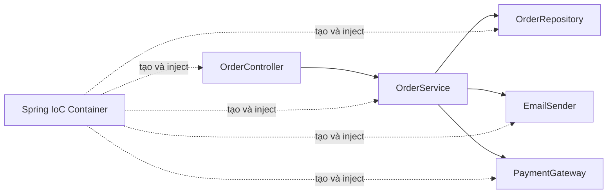

Các khái niệm quan trọng nhất:

```text
Dependency
    = object mà một object khác cần dùng.

Dependency Injection
    = dependency được cung cấp từ bên ngoài.

Inversion of Control
    = quyền tạo và kết nối object được chuyển ra khỏi business class.

Bean
    = object được Spring Container quản lý.

IoC Container
    = thành phần tạo, cấu hình, kết nối và quản lý bean.

ApplicationContext
    = giao diện container thường được sử dụng trong ứng dụng Spring.
```

---

# 2. Spring Framework là gì?

Spring Framework là một framework phát triển ứng dụng Java, đặc biệt phổ biến trong các ứng dụng backend, web và enterprise.

Có thể hiểu ngắn gọn:

> Spring là một hệ thống giúp tạo object, kết nối các object, quản lý vòng đời của chúng và cung cấp nhiều công cụ hạ tầng cho ứng dụng Java.

Spring không thay thế Java. Khi sử dụng Spring, chúng ta vẫn viết:

- Class và object.
- Interface.
- Constructor.
- Method.
- Exception.
- Collection.
- Lambda.
- Unit test.

Spring đứng ở tầng phía trên để quản lý cách các object Java phối hợp với nhau.

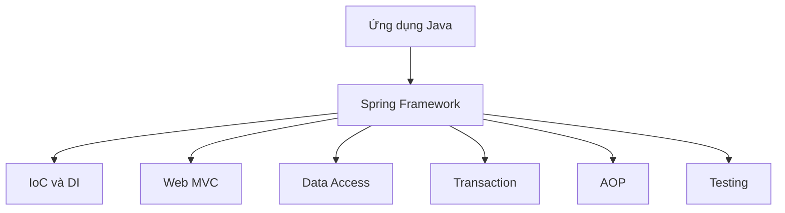

## 2.1 Spring Framework và Spring Boot

Hai khái niệm này thường bị nhầm lẫn.

### Spring Framework

Cung cấp nền tảng cốt lõi:

- IoC Container.
- Dependency Injection.
- Bean management.
- Spring MVC.
- Transaction management.
- JDBC support.
- AOP.
- Testing support.

### Spring Boot

Được xây dựng trên Spring Framework, giúp:

- Tạo project nhanh.
- Tự động cấu hình nhiều thành phần.
- Tích hợp sẵn web server.
- Chạy ứng dụng bằng file JAR.
- Giảm cấu hình thủ công.

```text
Spring Framework = động cơ và các bộ phận cốt lõi.

Spring Boot = chiếc xe đã được lắp ráp gần hoàn chỉnh
              từ những thành phần của Spring Framework.
```

Spring Boot vẫn sử dụng:

- Bean.
- IoC.
- DI.
- `ApplicationContext`.
- Spring MVC.
- Spring Data.
- Spring Security.

Vì vậy, hiểu Spring Framework là nền tảng để học Spring Boot tốt hơn.

---

# 3. Vì sao nên sử dụng Spring?

## 3.1 Spring xử lý phần hạ tầng

Một ứng dụng thực tế không chỉ có business logic. Nó còn phải xử lý:

- Kết nối database.
- Transaction.
- HTTP request và response.
- Validation.
- Authentication và authorization.
- Gửi email.
- Gọi external API.
- Logging.
- Scheduling.
- Testing.

Nếu tự xử lý tất cả, code sẽ dài và khó bảo trì. Spring cung cấp các abstraction và module để giảm lượng code hạ tầng phải viết.

## 3.2 Loose coupling

Spring giúp các class giảm phụ thuộc trực tiếp vào implementation cụ thể.

### Tight coupling

```java
public class OrderService {

    private final MySqlOrderRepository repository =
            new MySqlOrderRepository();
}
```

`OrderService` đang biết quá nhiều:

- Biết repository là MySQL.
- Biết class cụ thể.
- Biết cách tạo object.
- Bị buộc phải sửa code nếu đổi database.

### Loose coupling

```java
public class OrderService {

    private final OrderRepository repository;

    public OrderService(OrderRepository repository) {
        this.repository = repository;
    }
}
```

Bây giờ `OrderService` chỉ phụ thuộc vào abstraction:

```java
public interface OrderRepository {
    void save(Order order);
}
```

Có thể truyền nhiều implementation:

```text
MySqlOrderRepository
PostgresOrderRepository
InMemoryOrderRepository
FakeOrderRepository
```

## 3.3 Non-intrusive

Spring thường được mô tả là tương đối **non-intrusive**.

Business class có thể vẫn là class Java bình thường:

```java
public class PriceCalculator {

    public double calculate(double price, double tax) {
        return price + price * tax;
    }
}
```

Class này:

- Không cần kế thừa class của Spring.
- Không cần implement interface của Spring.
- Không cần gọi trực tiếp container.

Sau đó ta vẫn có thể đăng ký nó thành bean:

```java
@Configuration
public class AppConfig {

    @Bean
    public PriceCalculator priceCalculator() {
        return new PriceCalculator();
    }
}
```

## 3.4 Khi nào dùng Spring?

Spring phù hợp cho:

- REST API.
- Web application.
- Backend enterprise.
- Microservice.
- Ứng dụng kết nối database.
- Batch job.
- Scheduled job.
- Messaging application.
- Standalone Java application.
- Ứng dụng cần transaction và security.

---

# 4. Inversion of Control – IoC

## 4.1 Vấn đề khi object tự tạo dependency

Giả sử có chương trình hỏi câu hỏi.

```java
public interface QuizMaster {
    String popQuestion();
}
```

Hai implementation:

```java
public class SpringQuizMaster implements QuizMaster {

    @Override
    public String popQuestion() {
        return "What is Dependency Injection?";
    }
}
```

```java
public class StrutsQuizMaster implements QuizMaster {

    @Override
    public String popQuestion() {
        return "What is Struts Framework?";
    }
}
```

Service:

```java
public class QuizMasterService {

    private QuizMaster quizMaster =
            new SpringQuizMaster();

    public void askQuestion() {
        System.out.println(quizMaster.popQuestion());
    }
}
```

Dòng gây phụ thuộc chặt:

```java
new SpringQuizMaster();
```

Muốn đổi implementation phải sửa source code:

```java
private QuizMaster quizMaster =
        new StrutsQuizMaster();
```

## 4.2 Đảo ngược quyền kiểm soát

Thay vì để `QuizMasterService` tự tạo dependency:

```java
public class QuizMasterService {

    private final QuizMaster quizMaster;

    public QuizMasterService(QuizMaster quizMaster) {
        this.quizMaster = quizMaster;
    }

    public String askQuestion() {
        return quizMaster.popQuestion();
    }
}
```

Object được tạo ở bên ngoài:

```java
QuizMaster quizMaster = new SpringQuizMaster();

QuizMasterService service =
        new QuizMasterService(quizMaster);
```

Quyền kiểm soát việc tạo dependency đã được chuyển:

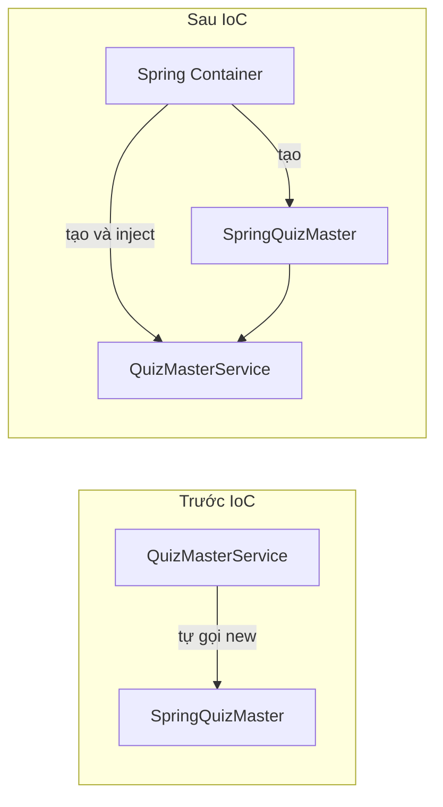

Đó là **Inversion of Control**.

## 4.3 Phân biệt IoC, DI, DIP và Container

| Khái niệm   | Ý nghĩa                                                               |
| ------------- | ----------------------------------------------------------------------- |
| IoC           | Nguyên lý chuyển quyền kiểm soát ra khỏi business object         |
| DI            | Kỹ thuật cung cấp dependency từ bên ngoài                         |
| IoC Container | Thành phần thực hiện tạo, kết nối và quản lý object           |
| DIP           | Nguyên lý thiết kế: phụ thuộc abstraction thay vì implementation |

Ví dụ:

```java
public class QuizMasterService {

    private final QuizMaster quizMaster;

    public QuizMasterService(QuizMaster quizMaster) {
        this.quizMaster = quizMaster;
    }
}
```

- Phụ thuộc vào interface `QuizMaster`: tư tưởng của DIP.
- Truyền dependency qua constructor: DI.
- Không tự tạo dependency: IoC.
- Spring thực hiện việc tạo và truyền: IoC Container.

---

# 5. Spring IoC Container

Spring IoC Container là trái tim của Spring Framework.

Container chịu trách nhiệm:

1. Đọc configuration metadata.
2. Tạo Bean Definition.
3. Khởi tạo object.
4. Tìm dependency.
5. Inject dependency.
6. Quản lý scope.
7. Quản lý lifecycle.
8. Cung cấp bean cho ứng dụng.

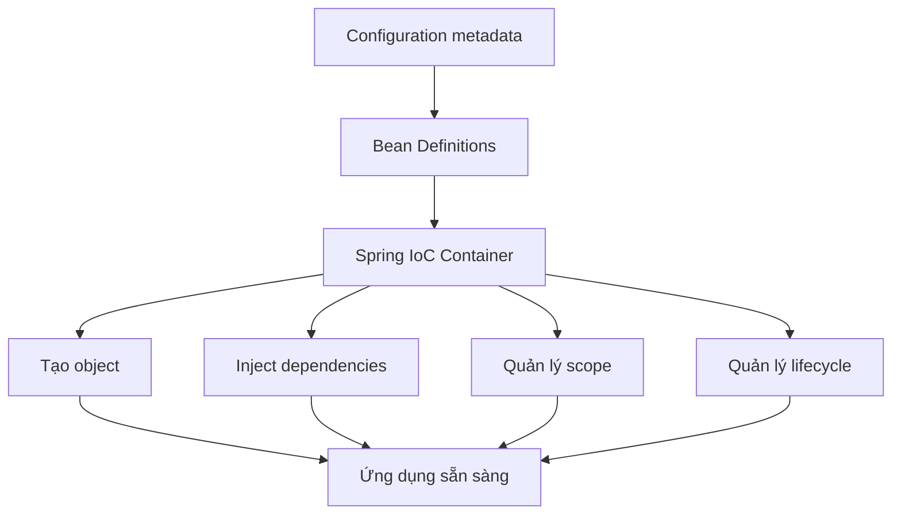

## 5.1 Configuration có thể đến từ đâu?

Spring có thể nhận metadata từ:

- XML.
- Java Configuration.
- Annotation và component scanning.
- Factory method.
- Cấu hình lập trình.

## 5.2 BeanFactory và ApplicationContext

### BeanFactory

`BeanFactory` là nền tảng cơ bản của IoC Container:

- Tạo bean.
- Tìm bean.
- Quản lý dependency cơ bản.

### ApplicationContext

`ApplicationContext` mở rộng `BeanFactory` và bổ sung nhiều khả năng:

- Lifecycle management.
- Event publication.
- Internationalization.
- Resource loading.
- Annotation processing.
- AOP integration.
- Web integration.

Trong phần lớn ứng dụng, chúng ta sử dụng `ApplicationContext`.

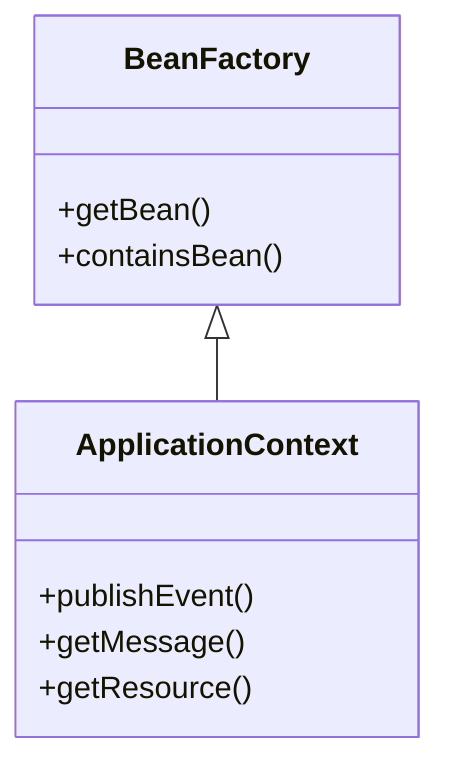

## 5.3 Khởi tạo ApplicationContext

### Java Configuration

```java
@Configuration
@ComponentScan("com.example")
public class AppConfig {
}
```

```java
try (AnnotationConfigApplicationContext context =
             new AnnotationConfigApplicationContext(AppConfig.class)) {

    QuizMasterService service =
            context.getBean(QuizMasterService.class);

    System.out.println(service.askQuestion());
}
```

### XML

```java
ApplicationContext context =
        new ClassPathXmlApplicationContext("beans.xml");
```

### Spring Boot

```java
ApplicationContext context =
        SpringApplication.run(Application.class, args);
```

Trong ứng dụng thực tế, không nên gọi `getBean()` ở khắp mọi nơi. Cách thông thường là để Spring inject dependency vào constructor.

---

# 6. Bean Overview

## 6.1 Spring Bean là gì?

> Spring Bean là một object được Spring IoC Container khởi tạo, lắp ráp, cấu hình và quản lý.

Bean vẫn là object Java bình thường.

```java
Author author = new Author();
```

Object này chưa chắc là Spring Bean, vì nó có thể được tạo thủ công.

```java
@Component
public class Author {
}
```

Nếu Spring quét class này và tạo object, object đó trở thành bean.

```text
Bạn tự gọi new         → object Java thông thường.

Spring tạo và quản lý  → Spring Bean.
```

## 6.2 Bean không phải là class

```text
Class = bản thiết kế Java.

Object = một instance được tạo từ class.

Bean = object được Spring quản lý.
```

Một class có thể tạo thành nhiều bean:

```java
@Configuration
public class AppConfig {

    @Bean
    public Author authorOne() {
        return new Author("John");
    }

    @Bean
    public Author authorTwo() {
        return new Author("Anna");
    }
}
```

Cả hai đều có kiểu `Author`, nhưng là hai Bean Definition và hai object khác nhau.

## 6.3 Bean Definition là gì?

Bean Definition là **bản mô tả để Spring biết cách tạo và quản lý bean**.

```text
Bean Definition = bản thiết kế dành cho container.

Bean            = object được tạo từ bản thiết kế đó.
```

Ví dụ:

```xml
<bean id="author"
      class="com.example.Author">
    <constructor-arg value="John"/>
</bean>
```

Metadata cho Spring biết:

- Tên bean: `author`.
- Class: `com.example.Author`.
- Constructor argument: `"John"`.
- Scope: mặc định singleton.
- Dependency và lifecycle nếu có.

## 6.4 Quá trình tạo bean

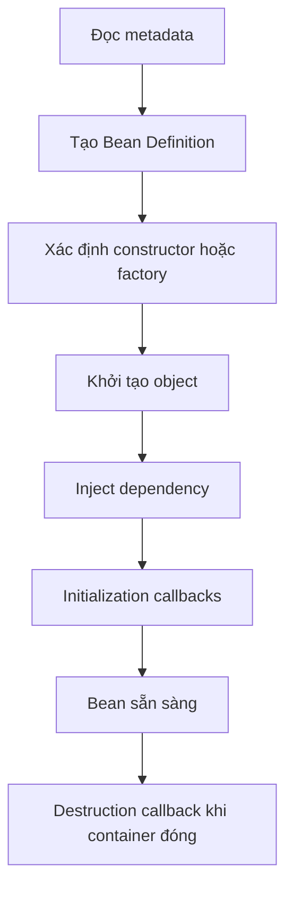

---

# 7. Các cách tạo Spring Bean

Ở mức thấp, Spring tạo bean theo ba cách chính:

1. Constructor.
2. Static factory method.
3. Instance factory method.

Trong project hiện đại, chúng ta thường khai báo chúng bằng:

- `@Component`.
- `@Bean`.
- XML.

## 7.1 Tạo bằng constructor

Class:

```java
public class Author {

    private final String name;

    public Author(String name) {
        this.name = name;
    }

    public String getName() {
        return name;
    }
}
```

Java thuần:

```java
Author author = new Author("Amuthan G");
```

### XML

```xml
<bean id="author"
      class="com.example.Author">
    <constructor-arg index="0"
                     value="Amuthan G"/>
</bean>
```

Spring thực hiện tương đương:

```java
new Author("Amuthan G");
```

### Java Configuration

```java
@Configuration
public class AppConfig {

    @Bean
    public Author author() {
        return new Author("Amuthan G");
    }
}
```

Mặc định tên bean là tên method:

```text
author
```

Có thể đổi tên:

```java
@Bean("mainAuthor")
public Author author() {
    return new Author("Amuthan G");
}
```

## 7.2 Tạo bằng static factory method

Class:

```java
public class ClientService {

    private static final ClientService INSTANCE =
            new ClientService();

    private ClientService() {
    }

    public static ClientService createInstance() {
        return INSTANCE;
    }
}
```

Không thể gọi constructor bên ngoài:

```java
// new ClientService(); // không hợp lệ vì constructor private
```

Phải gọi:

```java
ClientService service =
        ClientService.createInstance();
```

### XML

```xml
<bean id="clientService"
      class="com.example.ClientService"
      factory-method="createInstance"/>
```

Spring gọi:

```java
ClientService.createInstance();
```

### Java Configuration

```java
@Configuration
public class AppConfig {

    @Bean
    public ClientService clientService() {
        return ClientService.createInstance();
    }
}
```

## 7.3 Tạo bằng instance factory method

Factory object:

```java
public class ServiceFactory {

    public ClientService createClientService() {
        return new ClientService();
    }
}
```

Java thuần:

```java
ServiceFactory factory = new ServiceFactory();

ClientService service =
        factory.createClientService();
```

### XML

```xml
<bean id="serviceFactory"
      class="com.example.ServiceFactory"/>

<bean id="clientService"
      factory-bean="serviceFactory"
      factory-method="createClientService"/>
```

Spring thực hiện:

```java
ServiceFactory factory = new ServiceFactory();
ClientService service = factory.createClientService();
```

### Java Configuration

```java
@Configuration
public class AppConfig {

    @Bean
    public ServiceFactory serviceFactory() {
        return new ServiceFactory();
    }

    @Bean
    public ClientService clientService(
            ServiceFactory serviceFactory) {

        return serviceFactory.createClientService();
    }
}
```

## 7.4 So sánh

| Cách tạo       | Spring thực hiện tương đương |
| ---------------- | ----------------------------------- |
| Constructor      | `new Author()`                    |
| Static factory   | `ClientService.createInstance()`  |
| Instance factory | `factory.createClientService()`   |

---

# 8. Bean Scopes

Bean scope trả lời hai câu hỏi:

1. Spring tạo bao nhiêu instance?
2. Instance tồn tại trong phạm vi nào?

Các scope chính:

| Scope       | Phạm vi                                                      |
| ----------- | ------------------------------------------------------------- |
| singleton   | Một instance trên mỗi Bean Definition trong một container |
| prototype   | Instance mới mỗi lần container tạo/cung cấp bean         |
| request     | Một instance cho mỗi HTTP request                           |
| session     | Một instance cho mỗi HTTP session                           |
| application | Một instance trên mỗi`ServletContext`                    |
| websocket   | Một instance cho mỗi WebSocket session                      |

> `global-session` trong một số slide cũ gắn với môi trường Portlet và không phải scope thông dụng của ứng dụng Spring MVC hiện đại.

## 8.1 Singleton

Singleton là scope mặc định.

```java
@Component
public class HelloWorld {
}
```

Tương đương:

```java
@Component
@Scope("singleton")
public class HelloWorld {
}
```

Ví dụ:

```java
public class HelloWorld {

    private String message;

    public void setMessage(String message) {
        this.message = message;
    }

    public void printMessage() {
        System.out.println("Your Message: " + message);
    }
}
```

```java
HelloWorld objA =
        context.getBean("helloWorld", HelloWorld.class);

objA.setMessage("I'm object A");

HelloWorld objB =
        context.getBean("helloWorld", HelloWorld.class);

System.out.println(objA == objB);
objA.printMessage();
objB.printMessage();
```

Kết quả:

```text
true
Your Message: I'm object A
Your Message: I'm object A
```

Sơ đồ:

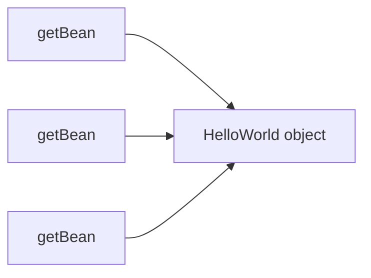

`objA` và `objB` là hai biến tham chiếu nhưng cùng trỏ đến một object.

### Spring singleton khác Singleton Design Pattern

Spring singleton nghĩa là:

```text
Một instance trên mỗi Bean Definition
trong mỗi Spring Container.
```

Nếu có hai `ApplicationContext`, mỗi context có thể có một singleton riêng.

## 8.2 Singleton và thread safety

Singleton không tự động thread-safe.

Ví dụ nguy hiểm:

```java
@Service
public class UserService {

    private String currentUsername;

    public void login(String username) {
        currentUsername = username;
    }

    public String getCurrentUsername() {
        return currentUsername;
    }
}
```

Nhiều request dùng chung một object nên dữ liệu có thể ghi đè lẫn nhau.

Nguyên tắc thực tế:

> Service, repository và controller singleton nên stateless hoặc chỉ giữ immutable state.

Ví dụ tốt hơn:

```java
@Service
public class PriceService {

    public double calculate(double price, double taxRate) {
        return price + price * taxRate;
    }
}
```

## 8.3 Prototype

```java
@Component
@Scope(ConfigurableBeanFactory.SCOPE_PROTOTYPE)
public class HelloWorld {
}
```

Hoặc XML:

```xml
<bean id="helloWorld"
      class="com.example.HelloWorld"
      scope="prototype"/>
```

Mỗi lần container cung cấp bean sẽ có instance mới:

```java
HelloWorld objA =
        context.getBean("helloWorld", HelloWorld.class);

objA.setMessage("I'm object A");

HelloWorld objB =
        context.getBean("helloWorld", HelloWorld.class);

System.out.println(objA == objB);
objA.printMessage();
objB.printMessage();
```

Kết quả:

```text
false
Your Message: I'm object A
Your Message: null
```

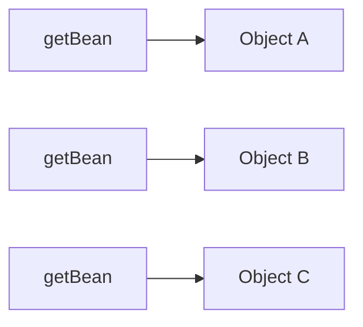

## 8.4 Inject prototype vào singleton

Ví dụ:

```java
@Component
@Scope(ConfigurableBeanFactory.SCOPE_PROTOTYPE)
public class ReportBuilder {
}
```

```java
@Service
public class ReportService {

    private final ReportBuilder reportBuilder;

    public ReportService(ReportBuilder reportBuilder) {
        this.reportBuilder = reportBuilder;
    }
}
```

`ReportService` là singleton. Dependency `ReportBuilder` thường được resolve một lần khi `ReportService` được tạo. Vì vậy, gọi method nhiều lần chưa chắc có prototype mới.

Muốn lấy object mới mỗi lần, có thể dùng `ObjectProvider`:

```java
@Service
public class ReportService {

    private final ObjectProvider<ReportBuilder> provider;

    public ReportService(
            ObjectProvider<ReportBuilder> provider) {

        this.provider = provider;
    }

    public void createReport() {
        ReportBuilder builder = provider.getObject();
        // Mỗi lần getObject() có thể nhận một prototype mới.
    }
}
```

## 8.5 Request scope

```java
@Component
@RequestScope
public class RequestContext {

    private final String traceId =
            UUID.randomUUID().toString();

    public String getTraceId() {
        return traceId;
    }
}
```

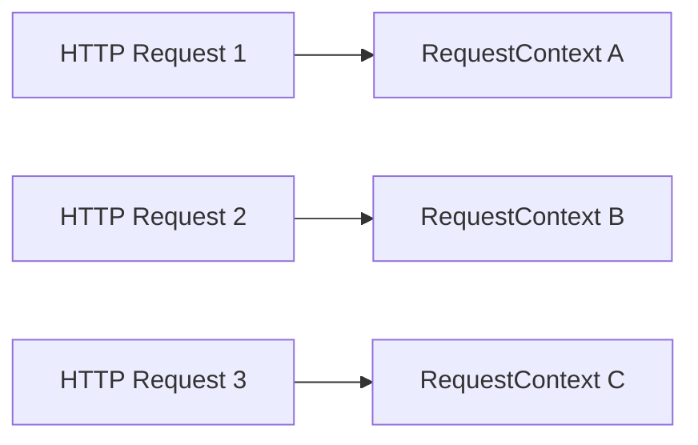

## 8.6 Session scope

```java
@Component
@SessionScope
public class ShoppingCart {

    private final List<String> products =
            new ArrayList<>();

    public void addProduct(String product) {
        products.add(product);
    }
}
```

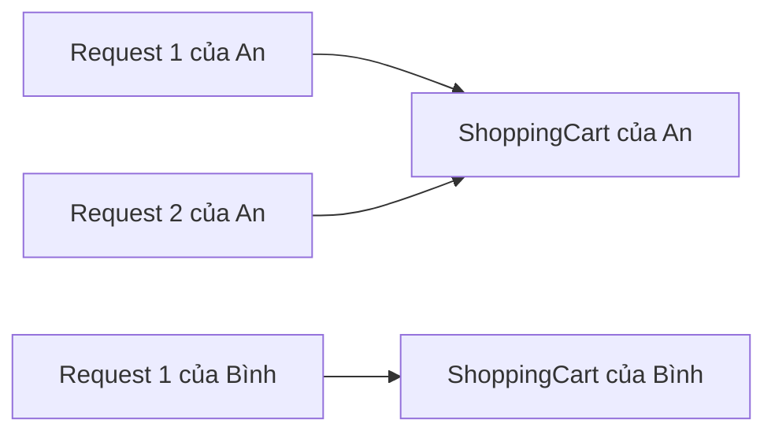

## 8.7 Application scope

```java
@Component
@ApplicationScope
public class ApplicationStatistics {

    private final AtomicLong requestCount =
            new AtomicLong();

    public long increment() {
        return requestCount.incrementAndGet();
    }
}
```

Application scope gắn với `ServletContext`, còn Spring singleton gắn với `ApplicationContext`.

## 8.8 Khi nào dùng scope nào?

| Scope       | Trường hợp thường gặp                                |
| ----------- | ---------------------------------------------------------- |
| singleton   | Service, repository, controller, mapper, validator         |
| prototype   | Builder có trạng thái, command object, temporary worker |
| request     | Trace ID, request metadata, request context                |
| session     | Shopping cart, wizard nhiều bước, preference tạm thời |
| application | Thống kê hoặc trạng thái chung cấp web application   |

---

# 9. Bean Lifecycle

Vòng đời đơn giản của bean:

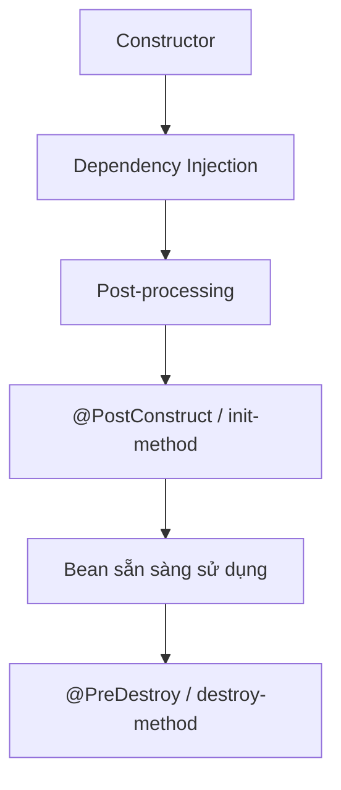

Ví dụ:

```java
@Component
public class DatabaseClient {

    @PostConstruct
    public void initialize() {
        System.out.println("DatabaseClient initialized");
    }

    @PreDestroy
    public void close() {
        System.out.println("DatabaseClient destroyed");
    }
}
```

## 9.1 `@PostConstruct`

Chạy sau khi dependency đã được inject.

Thường dùng để:

- Kiểm tra cấu hình.
- Khởi tạo dữ liệu nội bộ.
- Chuẩn bị resource.
- Xác nhận object đã ở trạng thái hợp lệ.

## 9.2 `@PreDestroy`

Chạy trước khi bean bị hủy.

Thường dùng để:

- Đóng resource.
- Dừng background thread.
- Flush dữ liệu.
- Giải phóng tài nguyên.

## 9.3 Prototype lifecycle

Spring tạo, inject và initialize prototype bean, nhưng không quản lý đầy đủ bước destruction sau khi giao object cho client.

Nếu prototype giữ:

- File.
- Stream.
- Connection.
- Native resource.

Client cần có chiến lược cleanup phù hợp.

---

# 10. Dependency Injection – DI

## 10.1 Dependency là gì?

Dependency là object mà object khác cần dùng để hoàn thành công việc.

```java
public class Book {

    private Author author;
}
```

`Author` là dependency của `Book`.

Ví dụ khác:

```java
public class PaymentService {

    private final PaymentGateway gateway;
    private final EmailSender emailSender;
}
```

`PaymentGateway` và `EmailSender` là dependency của `PaymentService`.

## 10.2 Dependency Injection là gì?

> Dependency Injection là quá trình dependency được tạo ở bên ngoài rồi truyền vào object cần sử dụng.

### Không dùng DI

```java
public class BookService {

    private final BookRepository repository =
            new MySqlBookRepository();
}
```

### Dùng DI

```java
public class BookService {

    private final BookRepository repository;

    public BookService(BookRepository repository) {
        this.repository = repository;
    }
}
```

Ở bên ngoài:

```java
BookRepository repository =
        new MySqlBookRepository();

BookService service =
        new BookService(repository);
```

Đây đã là DI dù chưa dùng Spring.

Spring tự động hóa quá trình này.

---

# 11. Các kiểu Dependency Injection

Có ba kiểu thường gặp:

1. Constructor injection.
2. Setter injection.
3. Field injection.

## 11.1 Constructor injection

```java
@Service
public class BookService {

    private final BookRepository repository;

    public BookService(BookRepository repository) {
        this.repository = repository;
    }
}
```

Ưu điểm:

- Dependency bắt buộc được thể hiện rõ.
- Field có thể dùng `final`.
- Object không thể được tạo ở trạng thái thiếu dependency.
- Dễ unit test.
- Dễ đọc.
- Phù hợp với immutable design.

Nếu class chỉ có một constructor, thường không cần `@Autowired`.

## 11.2 Setter injection

```java
@Service
public class BookService {

    private BookRepository repository;

    @Autowired
    public void setRepository(
            BookRepository repository) {

        this.repository = repository;
    }
}
```

Phù hợp hơn với dependency tùy chọn hoặc dependency cần thay đổi sau khi object được tạo.

Nhược điểm:

```java
BookService service = new BookService();
```

Object có thể tồn tại nhưng chưa có repository.

## 11.3 Field injection

```java
@Service
public class BookService {

    @Autowired
    private BookRepository repository;
}
```

Cách này ngắn nhưng có nhiều hạn chế:

- Dependency bị ẩn.
- Không thể dùng `final`.
- Khó unit test nếu không dùng reflection hoặc Spring context.
- Class bị phụ thuộc annotation framework rõ hơn.
- Khó phát hiện class có quá nhiều dependency.

Trong code mới, constructor injection thường là lựa chọn tốt hơn.

## 11.4 So sánh

| Kiểu       | Ưu điểm                      | Hạn chế                                              |
| ----------- | ------------------------------- | ------------------------------------------------------ |
| Constructor | Rõ ràng, immutable, dễ test  | Constructor dài nếu class có quá nhiều dependency |
| Setter      | Phù hợp dependency tùy chọn | Có thể tạo object chưa hoàn chỉnh                |
| Field       | Viết nhanh                     | Dependency ẩn, khó test, không dùng`final`       |

---

# 12. Cấu hình Dependency bằng XML

Giả sử có hai class:

```java
public class Author {

    private String name;

    public Author() {
    }

    public Author(String name) {
        this.name = name;
    }

    public String getName() {
        return name;
    }

    public void setName(String name) {
        this.name = name;
    }
}
```

```java
public class Book {

    private String name;
    private double price;
    private Author author;

    public Book() {
    }

    public Book(
            String name,
            double price,
            Author author) {

        this.name = name;
        this.price = price;
        this.author = author;
    }

    public void setAuthor(Author author) {
        this.author = author;
    }

    public Author getAuthor() {
        return author;
    }
}
```

## 12.1 Configuration by Reference

Java thuần:

```java
Author author = new Author("Amuthan G");

Book book = new Book();
book.setAuthor(author);
```

XML:

```xml
<bean id="author"
      class="train.java.spring.basic.Author">
    <constructor-arg index="0"
                     value="Amuthan G"/>
</bean>

<bean id="book"
      class="train.java.spring.basic.Book">
    <property name="author"
              ref="author"/>
</bean>
```

Phân biệt:

```text
value = truyền giá trị đơn giản.

ref   = truyền bean khác.
```

`<property name="author" ref="author"/>` yêu cầu class `Book` có setter tương ứng:

```java
public void setAuthor(Author author) {
    this.author = author;
}
```

## 12.2 Constructor-based DI bằng XML

```xml
<bean id="author"
      class="train.java.spring.basic.Author">
    <constructor-arg value="Amuthan G"/>
</bean>

<bean id="book"
      class="train.java.spring.basic.Book">
    <constructor-arg value="Spring MVC: Beginner's Guide"/>
    <constructor-arg value="12"/>
    <constructor-arg ref="author"/>
</bean>
```

Spring gọi tương đương:

```java
Author author = new Author("Amuthan G");

Book book = new Book(
        "Spring MVC: Beginner's Guide",
        12.0,
        author
);
```

## 12.3 Kết hợp constructor và setter DI

```xml
<bean id="book"
      class="train.java.spring.basic.Book">

    <constructor-arg value="Spring MVC: Beginner's Guide"/>
    <constructor-arg value="12"/>

    <property name="author"
              ref="author"/>
</bean>
```

`name` và `price` đi qua constructor, còn `author` đi qua setter.

## 12.4 Inner bean

### Bean riêng và reference

```xml
<bean id="customer"
      class="common.Customer">
    <property name="person"
              ref="person"/>
</bean>

<bean id="person"
      class="common.Person">
    <property name="name"
              value="mkyong"/>
    <property name="address"
              value="address1"/>
    <property name="age"
              value="28"/>
</bean>
```

### Inner bean

```xml
<bean id="customer"
      class="common.Customer">

    <property name="person">
        <bean class="common.Person">
            <property name="name"
                      value="mkyong"/>
            <property name="address"
                      value="address1"/>
            <property name="age"
                      value="28"/>
        </bean>
    </property>
</bean>
```

Inner bean phù hợp khi dependency chỉ phục vụ bean cha và không cần dùng lại.

## 12.5 Inject List

Class:

```java
public class Group {

    private List<Person> people;

    public void setPeople(List<Person> people) {
        this.people = people;
    }
}
```

XML:

```xml
<property name="people">
    <list>
        <ref bean="personOne"/>
        <ref bean="personTwo"/>

        <bean class="com.example.Person">
            <property name="name"
                      value="Inline Person"/>
        </bean>
    </list>
</property>
```

## 12.6 Inject Set

```xml
<property name="roles">
    <set>
        <value>ADMIN</value>
        <value>EDITOR</value>
        <value>VIEWER</value>
    </set>
</property>
```

## 12.7 Inject Map

```xml
<property name="services">
    <map>
        <entry key="book"
               value-ref="bookService"/>
        <entry key="author"
               value-ref="authorService"/>
    </map>
</property>
```

## 12.8 Inject Properties

```xml
<property name="contacts">
    <props>
        <prop key="admin">
            admin@nospam.com
        </prop>
        <prop key="support">
            support@nospam.com
        </prop>
    </props>
</property>
```

## 12.9 Null và empty value

Null:

```xml
<property name="description">
    <null/>
</property>
```

Chuỗi rỗng:

```xml
<property name="description"
          value=""/>
```

Hai giá trị này khác nhau:

```text
null  !=  ""
```

## 12.10 p-namespace

Cách thường:

```xml
<bean id="author"
      class="com.example.Author">
    <property name="name"
              value="John"/>
</bean>
```

Cách dùng p-namespace:

```xml
<bean id="author"
      class="com.example.Author"
      p:name="John"/>
```

## 12.11 Spring Expression Language – SpEL

SpEL cho phép sử dụng biểu thức trong cấu hình.

```java
@Value("#{systemProperties['user.home']}")
private String userHome;
```

Hoặc tham chiếu bean:

```java
@Value("#{priceService.defaultTaxRate}")
private double taxRate;
```

Cần phân biệt:

```text
${...} = property placeholder.

#{...} = Spring Expression Language.
```

---

# 13. Configuration Metadata

Configuration metadata là thông tin mô tả cho container:

- Bean nào cần tạo.
- Tạo bằng constructor hay factory.
- Dependency nào cần inject.
- Tên bean.
- Scope.
- Lazy hay eager.
- Initialization method.
- Destruction method.

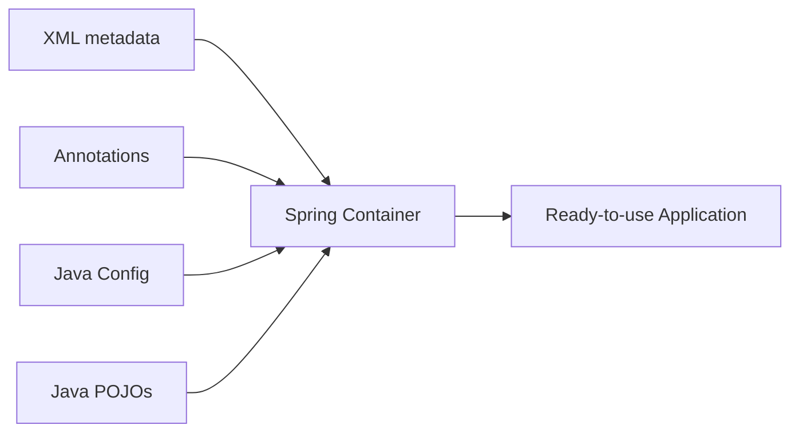

## 13.1 XML metadata

```xml
<bean id="author"
      class="com.example.Author"
      scope="prototype">
    <constructor-arg value="Amuthan G"/>
</bean>
```

## 13.2 Java Configuration

```java
@Configuration
public class AppConfig {

    @Bean
    @Scope(ConfigurableBeanFactory.SCOPE_PROTOTYPE)
    public Author author() {
        return new Author("Amuthan G");
    }
}
```

## 13.3 Annotation/component scanning

```java
@Component
public class Author {
}
```

```java
@Configuration
@ComponentScan("com.example")
public class AppConfig {
}
```

## 13.4 Khởi tạo container

Java Config:

```java
ApplicationContext context =
        new AnnotationConfigApplicationContext(
                AppConfig.class
        );
```

XML:

```java
ApplicationContext context =
        new ClassPathXmlApplicationContext(
                "spring-core-basic.xml"
        );
```

Lấy bean:

```java
Book book =
        context.getBean("book", Book.class);

System.out.println(book.getName());
System.out.println(book.getAuthor().getName());
```

---

# 14. Annotation-based Configuration

Annotation-based configuration là một lựa chọn thay cho XML hoặc có thể kết hợp với XML.

Các stereotype annotation:

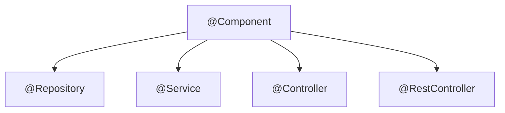

> `@Configuration` cũng được Spring quản lý như một component cấu hình, nhưng vai trò chính của nó là cung cấp Bean Definition bằng Java.

## 14.1 `@Component`

Annotation tổng quát:

```java
@Component
public class FileStorage {
}
```

## 14.2 `@Repository`

Dùng cho tầng truy cập dữ liệu:

```java
@Repository
public class JdbcBookRepository
        implements BookRepository {
}
```

Nó giúp biểu đạt đúng vai trò kiến trúc và hỗ trợ cơ chế chuyển đổi một số exception ở tầng persistence.

## 14.3 `@Service`

Dùng cho business logic:

```java
@Service
public class BookService {
}
```

## 14.4 `@Controller`

Dùng cho Spring MVC controller trả về view:

```java
@Controller
public class BookController {
}
```

## 14.5 `@RestController`

Dùng cho REST API:

```java
@RestController
@RequestMapping("/books")
public class BookController {
}
```

Có thể hiểu gần đúng:

```text
@RestController
= @Controller + response body cho các handler method.
```

---

# 15. Các Annotation cơ bản

## 15.1 `@Autowired`

Yêu cầu Spring tự động resolve dependency.

Constructor:

```java
@Component
public class Category {

    private final Book book;
    private final Author author;

    @Autowired
    public Category(Book book, Author author) {
        this.book = book;
        this.author = author;
    }
}
```

Nếu chỉ có một constructor:

```java
@Component
public class Category {

    private final Book book;
    private final Author author;

    public Category(Book book, Author author) {
        this.book = book;
        this.author = author;
    }
}
```

Spring vẫn có thể inject mà không cần ghi `@Autowired`.

## 15.2 `@Configuration`

Đánh dấu class cung cấp Java Configuration:

```java
@Configuration
public class AppConfig {
}
```

## 15.3 `@Bean`

Đăng ký object trả về từ method thành bean:

```java
@Bean
public Author author() {
    return new Author("Amuthan G");
}
```

## 15.4 `@ComponentScan`

Yêu cầu Spring quét package tìm component:

```java
@Configuration
@ComponentScan("train.java.spring.basic")
public class AppConfig {
}
```

Spring quét class có:

- `@Component`.
- `@Service`.
- `@Repository`.
- `@Controller`.
- `@RestController`.
- Các annotation được meta-annotated bằng `@Component`.

## 15.5 `@Import`

Import class cấu hình khác:

```java
@Configuration
@Import({
    RepositoryConfig.class,
    ServiceConfig.class
})
public class AppConfig {
}
```

## 15.6 `@ImportResource`

Import XML vào Java Configuration:

```java
@Configuration
@ImportResource(
    "classpath:/com/example/properties-config.xml"
)
public class AppConfig {
}
```

## 15.7 `@Qualifier`

Khi có nhiều bean cùng type:

```java
public interface MessageSender {
    void send(String message);
}
```

```java
@Component("emailSender")
public class EmailSender
        implements MessageSender {
}
```

```java
@Component("smsSender")
public class SmsSender
        implements MessageSender {
}
```

Inject đúng bean:

```java
@Service
public class NotificationService {

    private final MessageSender sender;

    public NotificationService(
            @Qualifier("emailSender")
            MessageSender sender) {

        this.sender = sender;
    }
}
```

## 15.8 `@Primary`

Đặt một bean làm lựa chọn mặc định:

```java
@Component
@Primary
public class EmailSender
        implements MessageSender {
}
```

## 15.9 `@Value`

Inject property:

```java
@Value("${app.name}")
private String applicationName;
```

## 15.10 `@Lazy`

Trì hoãn tạo bean đến khi cần:

```java
@Component
@Lazy
public class ExpensiveService {
}
```

## 15.11 `@DependsOn`

Yêu cầu một bean được khởi tạo sau bean khác:

```java
@Component
@DependsOn("databaseInitializer")
public class ReportService {
}
```

`@DependsOn` không phải DI. Nó chủ yếu xác định thứ tự khởi tạo trong trường hợp dependency không được thể hiện trực tiếp qua constructor hoặc property.

---

# 16. Các tính năng mở rộng của XML Configuration

## 16.1 Bean Definition Inheritance

Đây là kế thừa metadata, không phải Java inheritance.

```xml
<bean id="baseAction"
      abstract="true">
    <property name="speak"
              value="parent"/>
</bean>

<bean id="person"
      class="spring.basic.Person"
      parent="baseAction"
      init-method="initialize">

    <property name="speak"
              value="Hello"/>

    <property name="work"
              value="Go to school"/>
</bean>

<bean id="cat"
      class="spring.basic.Cat"
      parent="baseAction"
      init-method="initialize">

    <property name="speak"
              value="mew mew"/>
</bean>
```

`baseAction` là Bean Definition trừu tượng dùng làm mẫu. Nó không nhất thiết tạo object.

## 16.2 Importing Configuration Files

### `spring-repository-config.xml`

```xml
<beans>
    <bean id="finder"
          class="spring.basic.BookFinder"/>
</beans>
```

### `spring-service-config.xml`

```xml
<beans>
    <bean id="author"
          class="train.java.spring.basic.Author">
        <constructor-arg ref="finder"/>
    </bean>
</beans>
```

### `spring-context-config.xml`

```xml
<beans>
    <import resource=
        "classpath:spring-repository-config.xml"/>

    <import resource=
        "classpath:spring-service-config.xml"/>
</beans>
```

Lợi ích:

- Tách cấu hình theo module.
- Dễ đọc.
- Dễ bảo trì.
- Tránh một file XML quá lớn.

## 16.3 `depends-on`

```xml
<bean id="databaseInitializer"
      class="com.example.DatabaseInitializer"/>

<bean id="reportService"
      class="com.example.ReportService"
      depends-on="databaseInitializer"/>
```

Container sẽ khởi tạo `databaseInitializer` trước `reportService`.

## 16.4 Lazy initialization

```xml
<bean id="expensiveService"
      class="com.example.ExpensiveService"
      lazy-init="true"/>
```

Bean singleton mặc định thường được tạo khi container khởi động. `lazy-init="true"` trì hoãn đến khi bean thực sự được yêu cầu.

## 16.5 Property Placeholder

### `application.properties`

```properties
app.name=Book Store
app.max-results=100
```

### XML

```xml
<context:property-placeholder
    location="classpath:application.properties"/>

<bean id="searchConfig"
      class="com.example.SearchConfig">
    <property name="applicationName"
              value="${app.name}"/>
    <property name="maxResults"
              value="${app.max-results}"/>
</bean>
```

## 16.6 Kết hợp XML và Java Configuration

### XML làm trung tâm

```xml
<context:annotation-config/>
```

```java
ApplicationContext context =
        new ClassPathXmlApplicationContext(
                "system-test-config.xml"
        );
```

### Java Configuration làm trung tâm

```java
@Configuration
@ImportResource(
    "classpath:/com/example/properties-config.xml"
)
public class AppConfig {
}
```

```java
ApplicationContext context =
        new AnnotationConfigApplicationContext(
                AppConfig.class
        );
```

Việc kết hợp thường hữu ích khi:

- Chuyển dần project cũ từ XML sang Java Config.
- Một thư viện cũ vẫn cung cấp XML.
- Cần giữ cấu hình legacy.

---

# 17. Lợi ích của IoC và DI

## 17.1 Reduced Dependencies

Class không tự khóa vào implementation cụ thể.

```java
public class OrderService {

    private final OrderRepository repository;

    public OrderService(OrderRepository repository) {
        this.repository = repository;
    }
}
```

## 17.2 Reduced Dependency Carrying

Không phải tự tạo và truyền cả object graph thủ công.

Không dùng container:

```java
DataSource dataSource = new DataSource(...);
OrderRepository repository =
        new JdbcOrderRepository(dataSource);
EmailSender emailSender =
        new SmtpEmailSender(...);
OrderService service =
        new OrderService(repository, emailSender);
OrderController controller =
        new OrderController(service);
```

Dùng Spring, class chỉ khai báo dependency cần thiết. Container lắp ráp object graph.

## 17.3 More Reusable Code

Có thể sử dụng `OrderService` với:

- JDBC repository.
- JPA repository.
- In-memory repository.
- Fake repository trong test.

## 17.4 More Testable Code

```java
class BookServiceTest {

    @Test
    void returnsBookFromRepository() {
        BookRepository fakeRepository =
                id -> new Book(id, "Spring");

        BookService service =
                new BookService(fakeRepository);

        Book result = service.findById(1L);

        assertEquals("Spring", result.getName());
    }
}
```

Không cần khởi động toàn bộ Spring cho unit test đơn giản.

## 17.5 More Readable Code

Constructor thể hiện rõ dependency:

```java
public PaymentService(
        PaymentGateway gateway,
        EmailSender emailSender,
        PaymentRepository repository) {
}
```

Nếu constructor có quá nhiều dependency, đó có thể là dấu hiệu class đang có quá nhiều trách nhiệm.

## 17.6 Dễ thay implementation

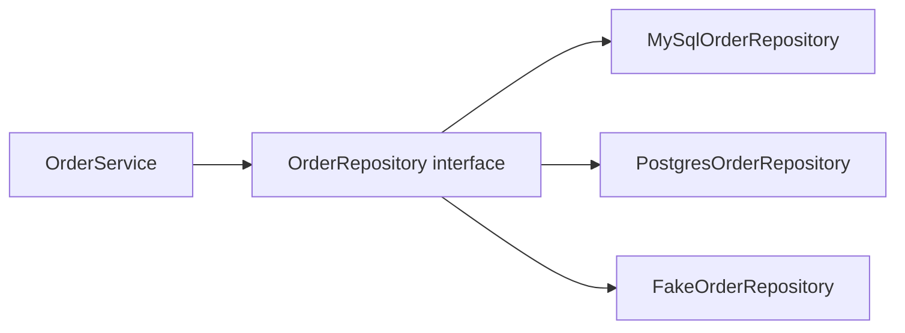

---

# 18. Spring Core Container Modules

Core Container là nền tảng của Spring Framework.

Các module chính trong nhóm này:

- `spring-core`.
- `spring-beans`.
- `spring-context`.
- Spring Expression Language.

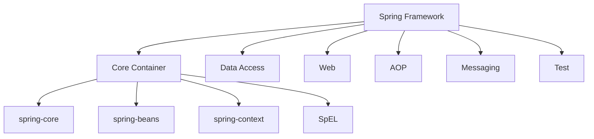

## 18.1 Core

Cung cấp các tiện ích nền tảng:

- Resource abstraction.
- Type conversion.
- Reflection utilities.
- Class loading utilities.
- Core infrastructure.

## 18.2 Beans

Cung cấp:

- BeanFactory.
- Bean Definition.
- Dependency Injection.
- Bean lifecycle.
- Bean scope.

## 18.3 Context

Cung cấp:

- ApplicationContext.
- Event publication.
- Resource loading.
- Internationalization.
- Annotation configuration.
- Integration với nhiều phần khác của Spring.

## 18.4 SpEL

Spring Expression Language cho phép:

- Truy cập property.
- Gọi method.
- Toán tử logic và số học.
- Truy cập bean.
- Biểu thức điều kiện.
- Đọc system properties.

## 18.5 Data Access / Integration

Các khả năng thường gặp:

- JDBC.
- Transaction management.
- ORM/JPA integration.
- JMS.
- OXM.
- R2DBC trong các ứng dụng reactive.

## 18.6 Web

- Spring Web.
- Spring Web MVC.
- WebSocket.
- WebFlux.

Một số thành phần như Portlet xuất hiện trong slide cũ nhưng không phải trọng tâm của Spring web hiện đại.

## 18.7 AOP

AOP xử lý cross-cutting concerns:

- Logging.
- Transaction.
- Security.
- Auditing.
- Performance measurement.

Ví dụ:

```java
@Transactional
public void transferMoney(
        Account from,
        Account to,
        BigDecimal amount) {
    // Business logic
}
```

## 18.8 Test

Spring hỗ trợ:

- TestContext Framework.
- Integration test.
- Spring MVC Test.
- Mock objects.
- WebTestClient.
- Transactional test support.

---

# 19. Spring Web MVC

Spring MVC sử dụng mô hình **Front Controller**. Thành phần trung tâm là `DispatcherServlet`.

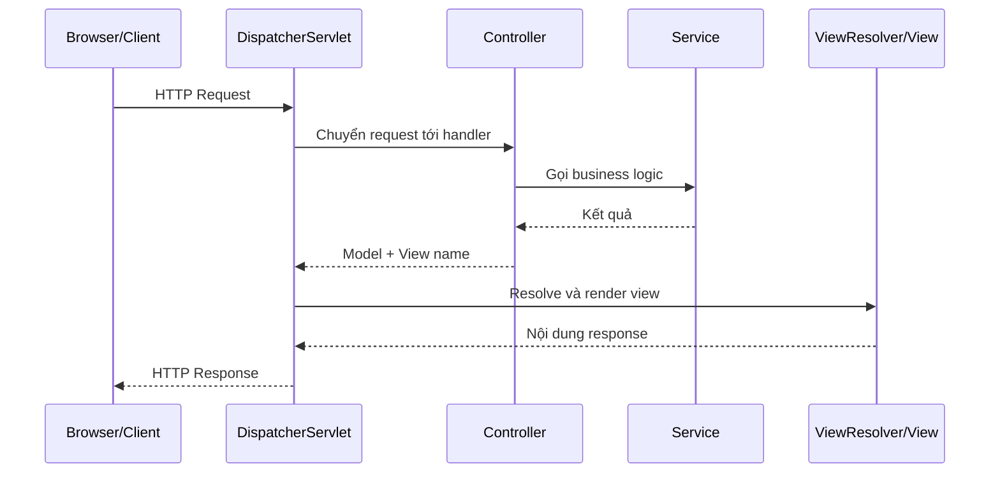

## 19.1 Vai trò của DispatcherServlet

- Nhận HTTP request.
- Tìm controller phù hợp.
- Gọi handler method.
- Nhận kết quả.
- Phối hợp render view hoặc ghi response body.
- Trả response cho client.

## 19.2 Controller trả về view

```java
@Controller
@RequestMapping("/books")
public class BookPageController {

    private final BookService bookService;

    public BookPageController(
            BookService bookService) {

        this.bookService = bookService;
    }

    @GetMapping
    public String listBooks(Model model) {
        model.addAttribute(
                "books",
                bookService.findAll()
        );

        return "books/list";
    }
}
```

`"books/list"` là logical view name. ViewResolver tìm template thực tế.

## 19.3 REST Controller

```java
@RestController
@RequestMapping("/api/books")
public class BookRestController {

    private final BookService bookService;

    public BookRestController(
            BookService bookService) {

        this.bookService = bookService;
    }

    @GetMapping("/{id}")
    public BookResponse findById(
            @PathVariable long id) {

        return bookService.findResponseById(id);
    }
}
```

Luồng REST:

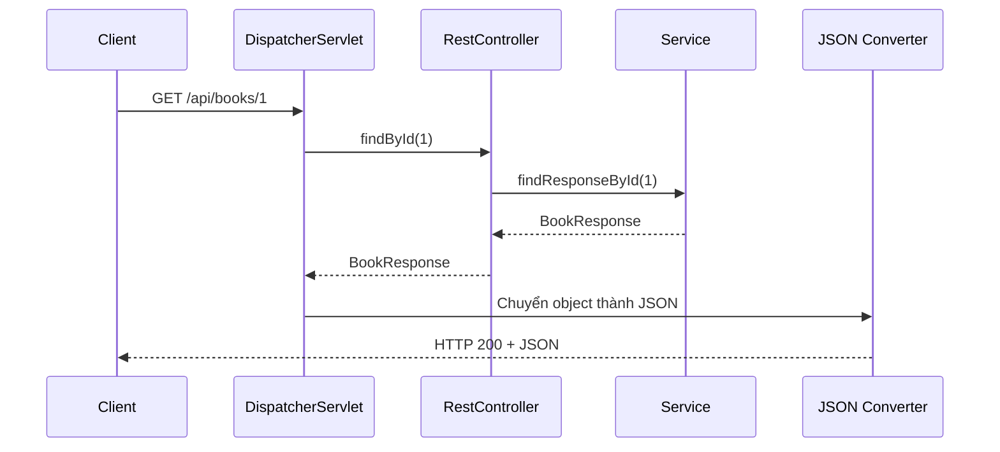

---

# 20. Ví dụ ứng dụng hoàn chỉnh

Ví dụ nhỏ về quản lý sách.

## 20.1 Cấu trúc package

```text
com.example.bookstore
├── BookStoreApplication.java
├── controller
│   └── BookController.java
├── service
│   └── BookService.java
├── repository
│   ├── BookRepository.java
│   └── InMemoryBookRepository.java
└── model
    └── Book.java
```

## 20.2 Model

```java
package com.example.bookstore.model;

public record Book(
        long id,
        String title,
        String author) {
}
```

## 20.3 Repository interface

```java
package com.example.bookstore.repository;

import com.example.bookstore.model.Book;

import java.util.List;
import java.util.Optional;

public interface BookRepository {

    List<Book> findAll();

    Optional<Book> findById(long id);
}
```

## 20.4 Repository implementation

```java
package com.example.bookstore.repository;

import com.example.bookstore.model.Book;
import org.springframework.stereotype.Repository;

import java.util.List;
import java.util.Optional;

@Repository
public class InMemoryBookRepository
        implements BookRepository {

    private final List<Book> books = List.of(
            new Book(
                    1L,
                    "Spring Fundamentals",
                    "Alice"
            ),
            new Book(
                    2L,
                    "Java Core",
                    "Bob"
            )
    );

    @Override
    public List<Book> findAll() {
        return books;
    }

    @Override
    public Optional<Book> findById(long id) {
        return books.stream()
                .filter(book -> book.id() == id)
                .findFirst();
    }
}
```

## 20.5 Service

```java
package com.example.bookstore.service;

import com.example.bookstore.model.Book;
import com.example.bookstore.repository.BookRepository;
import org.springframework.stereotype.Service;

import java.util.List;
import java.util.NoSuchElementException;

@Service
public class BookService {

    private final BookRepository repository;

    public BookService(BookRepository repository) {
        this.repository = repository;
    }

    public List<Book> findAll() {
        return repository.findAll();
    }

    public Book findById(long id) {
        return repository.findById(id)
                .orElseThrow(
                        () -> new NoSuchElementException(
                                "Book not found: " + id
                        )
                );
    }
}
```

## 20.6 REST Controller

```java
package com.example.bookstore.controller;

import com.example.bookstore.model.Book;
import com.example.bookstore.service.BookService;
import org.springframework.web.bind.annotation.*;

import java.util.List;

@RestController
@RequestMapping("/api/books")
public class BookController {

    private final BookService service;

    public BookController(BookService service) {
        this.service = service;
    }

    @GetMapping
    public List<Book> findAll() {
        return service.findAll();
    }

    @GetMapping("/{id}")
    public Book findById(
            @PathVariable long id) {

        return service.findById(id);
    }
}
```

## 20.7 Main application

```java
package com.example.bookstore;

import org.springframework.boot.SpringApplication;
import org.springframework.boot.autoconfigure.SpringBootApplication;

@SpringBootApplication
public class BookStoreApplication {

    public static void main(String[] args) {
        SpringApplication.run(
                BookStoreApplication.class,
                args
        );
    }
}
```

## 20.8 Object graph

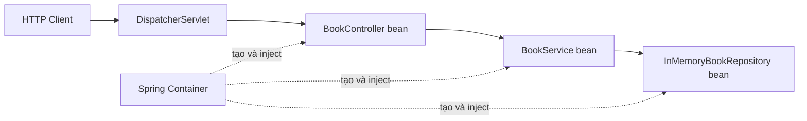

Spring thực hiện tương đương về mặt ý tưởng:

```java
BookRepository repository =
        new InMemoryBookRepository();

BookService service =
        new BookService(repository);

BookController controller =
        new BookController(service);
```

Nhưng container còn quản lý:

- Bean Definition.
- Scope.
- Lifecycle.
- Proxy.
- Annotation.
- Web mapping.
- Các tính năng hạ tầng khác.

## 20.9 Unit test không cần Spring

```java
class BookServiceTest {

    @Test
    void findsBookById() {
        Book expected =
                new Book(1L, "Test Book", "Tester");

        BookRepository fakeRepository =
                new BookRepository() {

                    @Override
                    public List<Book> findAll() {
                        return List.of(expected);
                    }

                    @Override
                    public Optional<Book> findById(
                            long id) {

                        return id == 1L
                                ? Optional.of(expected)
                                : Optional.empty();
                    }
                };

        BookService service =
                new BookService(fakeRepository);

        Book result = service.findById(1L);

        assertEquals(expected, result);
    }
}
```

DI giúp thay repository thật bằng fake repository dễ dàng.

---

# 21. Các lỗi tư duy thường gặp

## 21.1 “Có `new` thì object chắc chắn không phải bean”

Không hoàn toàn đúng.

Trong method `@Bean`:

```java
@Bean
public Author author() {
    return new Author();
}
```

Có `new`, nhưng object trả về vẫn được đăng ký và quản lý như Spring Bean.

Điểm quyết định là:

```text
Object có được Spring Container quản lý hay không?
```

## 21.2 “Mọi object trong ứng dụng Spring đều là bean”

Không đúng.

```java
Book temporaryBook =
        new Book(...);
```

Nếu object này được tạo và sử dụng thủ công, không đăng ký với container, nó không phải Spring Bean.

## 21.3 “DI là `@Autowired`”

Không đúng.

DI là nguyên lý/kỹ thuật. `@Autowired` chỉ là một cách yêu cầu Spring thực hiện DI.

Đoạn code sau vẫn là DI dù không có annotation:

```java
public BookService(BookRepository repository) {
    this.repository = repository;
}
```

## 21.4 “IoC và DI hoàn toàn giống nhau”

DI là một hình thức cụ thể của IoC. IoC là ý tưởng rộng hơn về việc chuyển quyền điều khiển cho framework/container.

## 21.5 “Singleton bean luôn thread-safe”

Không đúng. Scope singleton chỉ nói về số lượng instance, không đảm bảo thread safety.

## 21.6 “Prototype luôn tạo object mới trong mọi method call”

Không đúng. Prototype tạo mới khi container thực sự resolve bean. Inject trực tiếp prototype vào singleton thường chỉ resolve một lần lúc tạo singleton.

## 21.7 “`@Service`, `@Repository`, `@Controller` hoàn toàn khác `@Component`”

Chúng đều là stereotype component, nhưng mang ý nghĩa kiến trúc khác nhau và một số annotation có thêm semantics riêng.

## 21.8 “Càng nhiều dependency càng tốt vì Spring inject được”

Không đúng. Một constructor quá dài có thể cho thấy class vi phạm Single Responsibility Principle.

## 21.9 “Dùng Spring là code tự động tốt”

Spring giúp quản lý hạ tầng, nhưng không tự động bảo đảm:

- Thiết kế tốt.
- Business logic đúng.
- Không có bug.
- Thread safety.
- Hiệu năng tốt.
- Security đúng.

---

# 22. Bảng ghi nhớ nhanh

## 22.1 Khái niệm

| Thuật ngữ        | Ghi nhớ                                       |
| ------------------ | ---------------------------------------------- |
| Dependency         | Object mà object khác cần                   |
| DI                 | Truyền dependency từ bên ngoài             |
| IoC                | Chuyển quyền tạo/kết nối object ra ngoài |
| Bean               | Object được Spring quản lý                |
| Bean Definition    | Metadata mô tả cách tạo bean               |
| Container          | Tạo, inject, quản lý bean                   |
| ApplicationContext | Container thường dùng                       |
| Scope              | Số lượng và phạm vi sống của bean       |

## 22.2 Annotation

| Annotation          | Mục đích                               |
| ------------------- | ----------------------------------------- |
| `@Component`      | Component tổng quát                     |
| `@Service`        | Business/service layer                    |
| `@Repository`     | Data access layer                         |
| `@Controller`     | MVC controller                            |
| `@RestController` | REST controller                           |
| `@Configuration`  | Java configuration class                  |
| `@Bean`           | Đăng ký object trả về thành bean    |
| `@ComponentScan`  | Quét component                           |
| `@Autowired`      | Tự động inject                         |
| `@Qualifier`      | Chọn bean cụ thể                       |
| `@Primary`        | Bean mặc định khi có nhiều candidate |
| `@Scope`          | Chọn bean scope                          |
| `@Lazy`           | Tạo bean khi cần                        |
| `@DependsOn`      | Quy định dependency khởi tạo          |
| `@Import`         | Import Java configuration                 |
| `@ImportResource` | Import XML configuration                  |
| `@Value`          | Inject property hoặc expression          |

## 22.3 Constructor, setter và field injection

```text
Constructor injection
    → ưu tiên cho dependency bắt buộc.

Setter injection
    → phù hợp dependency tùy chọn.

Field injection
    → viết nhanh nhưng khó test và che giấu dependency.
```

## 22.4 Quy trình đọc một Spring class

Khi gặp một class, hãy hỏi:

1. Class này có phải bean không?
2. Bean được đăng ký bằng annotation, `@Bean` hay XML?
3. Scope là gì?
4. Dependency là gì?
5. Dependency được inject bằng constructor hay setter?
6. Có nhiều implementation cùng type không?
7. Có cần `@Qualifier` hoặc `@Primary` không?
8. Bean có mutable state không?
9. Bean có cần initialization hoặc cleanup không?
10. Class có đang có quá nhiều trách nhiệm không?

## 22.5 Câu kết luận quan trọng nhất

> Cốt lõi của Spring không phải là annotation. Cốt lõi của Spring là quản lý object và dependency thông qua IoC Container. Annotation, XML và Java Configuration chỉ là các cách cung cấp metadata cho container.

---

# 23. Tài liệu tham khảo chính thức

1. Spring Framework Overviewhttps://docs.spring.io/spring-framework/reference/overview.html
2. Introduction to the Spring IoC Container and Beanshttps://docs.spring.io/spring-framework/reference/core/beans/introduction.html
3. Container Overviewhttps://docs.spring.io/spring-framework/reference/core/beans/basics.html
4. Bean Overviewhttps://docs.spring.io/spring-framework/reference/core/beans/definition.html
5. Dependency Injectionhttps://docs.spring.io/spring-framework/reference/core/beans/dependencies/factory-collaborators.html
6. Bean Scopeshttps://docs.spring.io/spring-framework/reference/core/beans/factory-scopes.html
7. Annotation-based Container Configurationhttps://docs.spring.io/spring-framework/reference/core/beans/annotation-config.html
8. Classpath Scanning and Managed Componentshttps://docs.spring.io/spring-framework/reference/core/beans/classpath-scanning.html
9. Using the `@Bean` Annotationhttps://docs.spring.io/spring-framework/reference/core/beans/java/bean-annotation.html
10. Spring Web MVC and DispatcherServlet
    https://docs.spring.io/spring-framework/reference/web/webmvc/mvc-servlet.html

---

## Ghi chú về nội dung slide

Một số slide sử dụng cách cấu hình và thuật ngữ phổ biến trong các phiên bản Spring cũ, ví dụ:

- XML là phương thức cấu hình chính.
- `Portlet`.
- `global-session`.
- Một số schema XML có version cũ.

Những nội dung này vẫn hữu ích để hiểu cơ chế nền tảng và đọc project legacy. Trong project Spring Boot hiện đại, cách thường gặp hơn là:

```text
Constructor injection
+ Component scanning
+ Java Configuration
+ Spring Boot auto-configuration
```
